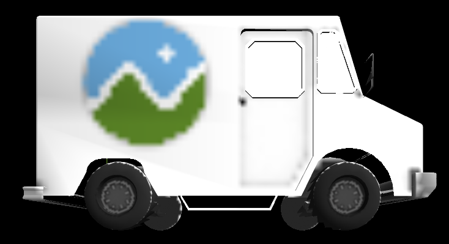

CUDA Rasterizer
===============

**A rasterization pipeline build in Nvidia's CUDA parallel API. Features perspective-correct, bilinear filtered texture mapping, backface culling with stream compaction, supersampled antialiasing.**
**University of Pennsylvania, CIS 565: GPU Programming and Architecture, Project 6**

* Daniel Daley-Mongtomery
* Tested on: MacBook Pro, OSX 10.12, i7 @ 2.3GHz, 16GB RAM, GT 750M 2048MB (Personal Machine)
### Implementation

  No 3D graphics pipeline can afford to physically model rays of light like a path tracer if it has to produce consistent imagery at interactive speeds. Modern real-time APIs like OpenGL, D3D, and Vulkan generally assume a process wherein vertex data is transformed, assembled into triangles, and projected onto a 2D screen space (rasterized) to be lit on a pixel-by-pixel basis. In this project I will implement such a pipeline in CUDA in order better grasp the subtleties and bottlenecks involved in interactive graphics.

##### Compose Vertices and Assemble primitives

  Perhaps the simplest step comes first: having recieved input geometry from a provided gltf reader, I transform each vertex in parallel, storing its screen-space position, depth, and normals, as well as texture and UV invformation. I then traverse the indices specified by the gltf model to assign each vertex to a triangle primitive.
  
  Before moving onto rasterization, an extremely expensive operation, I make sure to cull geometry facing away form the camera. Using thrust's stream compaction, I can group all front-facing triangles at the beginning of the primitive array, and so launch fewer rasterization kernels later on. Below is a debug image showing *only* those backfaces which my final rasterizer eliminates.

##### Rasterize Primitives

  The biggest challenge I encountered was rasterization. While it seems simple enough, I poured hours into different methods to speed it up to little avail. I parallelized over triangles; each kernel checked the XY bounding box of its triangle to see if any given fragment lay within its boundaries, as shown below:
  

  When I found a fragment that did fall within the triangle, I checked a screen-sized depth buffer to see if any closer fragments had already been uncovered. If they hadn't, I atomically updated the depth buffer, then packed barycentrically-interpolated normal, UV, and texture data to a fragment buffer for later shading. In this way, no occluded fragments end up shaded, rather like a deferred pipeline.

Because perspective projection shrinks distant objects, linearly interpolating in screen space yields incorrect UV values. I had to adjust the UV-interpolation [accordingly](http://web.cs.ucdavis.edu/~amenta/s12/perspectiveCorrect.pdf).

| None        | Some           |
| ------------- |:-------------:|
|  | |

  Being low-hanging fruit, I also threw in naive supersampled antialiasing. I uniformly subdivided each fragment and ran both my rasterization and shading step for each, accumulating framebuffer contributions for each.

| Single Sample | 2x2 Uniform |
| ------------- |:-------------:|
|  | |

##### Shade Fragments

The last step was to shade the fragments that made it through. With lambert shading from the normal simple texture lookups based on UVs, I could create colorful triangles in realtime! I added bilinear texure filtering to smooth out lower-res images and more fairly treat fragments whose UVs didn't fall dead-center on a pixel:

| Single Pixel Sample | Bilinearly Sampled |
| ------------- |:-------------:|
|  | |
|  | |

##### Performance

  The cost of my texture features was not as influential as I might have expected, largely because of the amount of time taken by my rasterization step. But given the weight of rasterization, I was surprised how little backface culling helped. I could demonstrate that I was launching about half as many _generateFragments()_ kernels, but saw a < 10% speedup. Clearly my biggest issue was the duration of these kernels.

Some remaining hopes I have at improvement are better a [bettter scanline algorithm](http://forum.devmaster.net/t/advanced-rasterization/6145/24), and sorting triangles by their XY bounding-box area before rasterizing. While it might not be cheap enough to be worthwhile, it would put kernels with similar numbers of tests in the same warps and less time is spent waiting.

### Credits

* [tinygltfloader](https://github.com/syoyo/tinygltfloader) by [@soyoyo](https://github.com/syoyo)
* [glTF Sample Models](https://github.com/KhronosGroup/glTF/blob/master/sampleModels/README.md)
