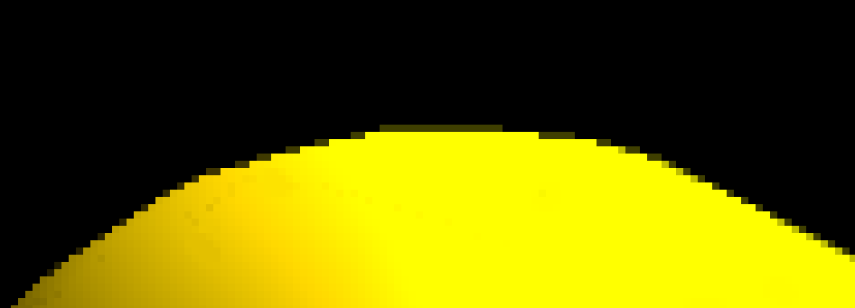

CUDA Rasterizer
===============

[CLICK ME FOR INSTRUCTION OF THIS PROJECT](./INSTRUCTION.md)

**A rasterization pipeline build in Nvidia's CUDA parallel API. Features perspective-correct, bilinear filtered texture mapping, backface culling with stream compaction, supersampled antialiasing.**
**University of Pennsylvania, CIS 565: GPU Programming and Architecture, Project 6**

* Daniel Daley-Mongtomery
* Tested on: MacBook Pro, OSX 10.12, i7 @ 2.3GHz, 16GB RAM, GT 750M 2048MB (Personal Machine)

##### Compose Vertices and Assemble primitives

##### Rasterize Primitives

| None        | Some           |
| ------------- |:-------------:|
|  | |

##### Shade Fragments

| None        | Some           |
| ------------- |:-------------:|
|  | |

| None        | Some           |
| ------------- |:-------------:|
|  | |
|  | |

##### Performance

### Credits

* [tinygltfloader](https://github.com/syoyo/tinygltfloader) by [@soyoyo](https://github.com/syoyo)
* [glTF Sample Models](https://github.com/KhronosGroup/glTF/blob/master/sampleModels/README.md)
